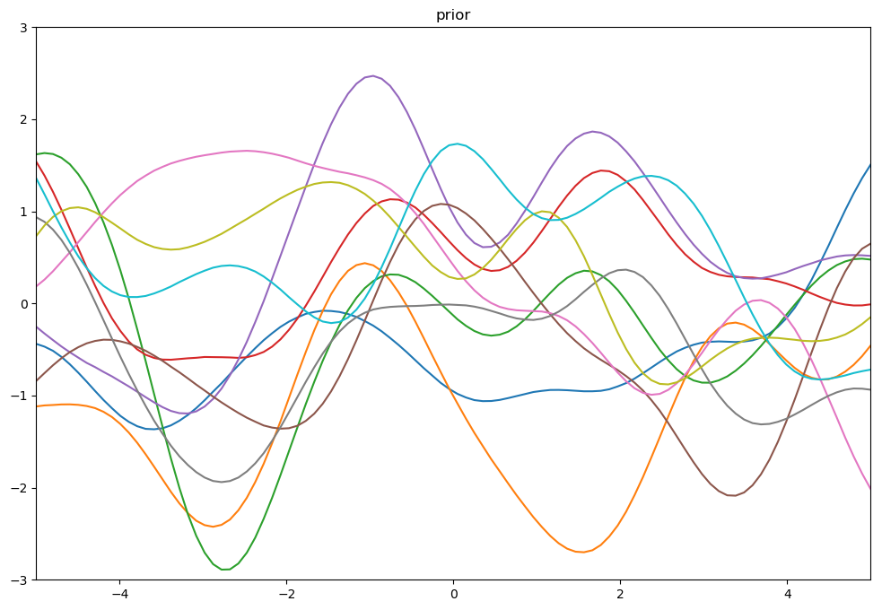
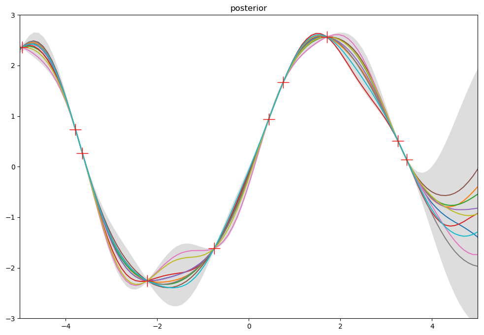
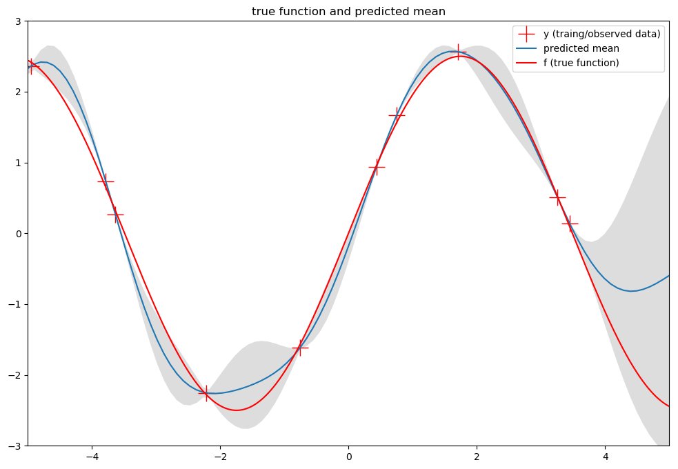
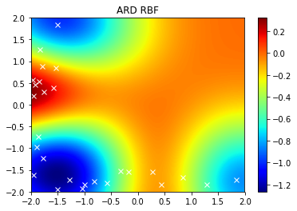
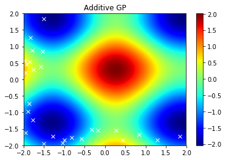
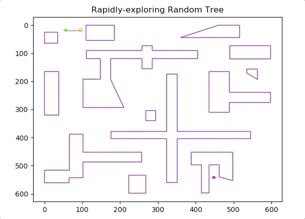
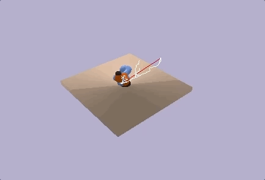
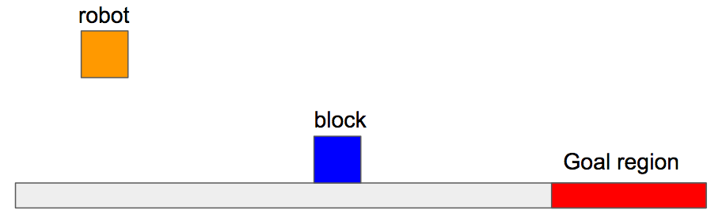
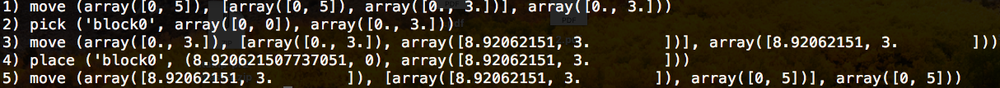

Work Notes at Learning and Intelligent Systems Lab, MIT

# Table of Contents
<!-- TOC depthFrom:1 depthTo:6 withLinks:1 updateOnSave:0 orderedList:0 -->

- [Table of Contents](#table-of-contents)
- [Week 0](#week-0)
- [Week 1](#week-1)
	- [June 4th](#june-4th)
	- [June 5th](#june-5th)
	- [June 6th](#june-6th)
	- [June 7th - June 8th](#june-7th---june-8th)
- [Week 2](#week-2)
	- [June 11th - June 12th](#june-11th---june-12th)
	- [June 13th - June 15th](#june-13th---june-15th)
- [Week 3](#week-3)
	- [June 18th](#june-18th)
	- [June 19 - June 22](#june-19---june-22)
- [Week 4](#week-4)
	- [June 25 June 27](#june-25---june-27)
	- [June 28 - June 29](#june-28---june-29)
- [Week 5](#week-5)
  - [July 2 - July 3](#july-2---july-3)

<!-- /TOC -->
---

# Week 0
__May 28th - June 1st__
- [X] use an existing domain file from [pddlstream](https://github.com/caelan/pddlstream) to solve Sussman anomaly ([code](pddl_examples/sussman_anomaly))
- [X] create a planning problem of cooking a meal and solve it use the [pddlstream](https://github.com/caelan/pddlstream) ([code](pddl_examples/cook_meal))
- [X] add a score function to learn the stir action parameters for [Kitchen2D](https://github.com/JingxiXu/Kitchen2D)
  - The score function is still very naive and is purely equivalent to the combined entropy of multiple partitions. The learning of stir action suffers
  from the fact that the particles start moving and mixing right after they are created. So the score function is changing even before stiring
  and the score is pretty high initially.
  - It might be better to think about the maximum entropy of a combination of multiple parts. Because if one kind of particle has a dominant
  proportion, then the score of stir defined above will always be low, but it does not mean we do not stir well.

# Week 1
### June 4th
- [X] write a script to sample functions from gaussian process ([code](gaussian_process))

 &emsp;
 &emsp;
 &emsp;

### June 5th
- [X] read the paper [Additive Gaussian Process](https://arxiv.org/abs/1112.4394)
- [X] reimplement the above paper's experiment on toy synthetic data and obtain similar results ([code](https://github.com/jingxixu/lis-work/blob/master/additive-gps/sythetic_demo.ipynb))

 &emsp;
 &emsp;
 &emsp;

### June 6th
- [X] with the help of Caelan, make all pybullet examples at [pddlstream](https://github.com/caelan/pddlstream) runnable by fixing breaking commit
- [X] finish [Robot Academy](https://github.com/Learning-and-Intelligent-Systems/lis_pr2_pkg/wiki/Robot-Academy) class 1 ([code](robot_accademy), [video](https://youtu.be/N1F5F4eFNtI))

<a href="https://youtu.be/N1F5F4eFNtI">

  

</a>

### June 7th - June 8th
- [X] finish [Robot Academy](https://github.com/Learning-and-Intelligent-Systems/lis_pr2_pkg/wiki/Robot-Academy) class 2, class 3 and class 5 ([code](robot_accademy), [video](https://youtu.be/5Gty81elUDA))

<a href="https://youtu.be/5Gty81elUDA">

  

</a>

# Week 2
### June 11th - June 12th
- [X] implement RRT and biRRT with visualization ([code](biRRT))

   &emsp;
  

- [X] create kuka robot, PR2 and some objects in pybullet
- [X] manage to set the drake kuka end-effector to a certain position in space using the pybullet IK solver

### June 13th - June 15th
- [X] implement an RRT in the configuration space in pybullet

   &emsp;
  

- [X] compare my RRT implementation with Caelan's RRT in the following created scenario ([code](https://github.com/jingxixu/Kitchen3D))
  - Caelan's RRT is more efficient in difficult motion planning problems because it keeps extending towards the sample
  step by step until it collides, while my RRT only makes a small step towards the sample on each iteration
  - However, even Caelan's RRT can only find a good path (on the right) approximately one out of 20 experiments. It normally
  returns a bad path on the left, and takes a long time.
  - Should not spend time on improving the efficiency and performance of RRT, just use biRRT.

   &emsp;
  

# Week 3
### June 18th
- [X] finish homework 3 ([pdf](proof/proof.pdf))
- [X] implement my own distance function. Given 2 configurations, first calculate the corresponding end-effector positions in workspace and then use the euclidean distance between 2 positions as the distance of the two configurations. Run RRT using each distance metric for 10 times (with max iteration 200) and the results are shown as follows ([code](https://github.com/jingxixu/Kitchen3D))
  - Euclidean distance in the workspace used as a metric for RRT algorithm

    | exp no. |   1   |   2  |   3   |   4   |   5   |   6  |   7   |   8   |   9  |   10   |
    |:-------:|:-----:|:----:|:-----:|:-----:|:-----:|:----:|:-----:|:-----:|:----:|:------:|
    | time(s) | 91.47 | 5.09 | 12.79 | 48.91 | 10.20 | fail | 21.73 | 11.23 | 9.59 | 133.12 |

  - Euclidean distance used in configuration space

    | exp no. |   1  |   2  |   3  |   4  |   5  |   6  |   7   |   8   |   9  |  10  |
    |:-------:|:----:|:----:|:----:|:----:|:----:|:----:|:-----:|:-----:|:----:|:----:|
    | time(s) | fail | fail | fail | fail | fail | fail | 37.36 | 19.30 | fail | fail |

  - demo of how fast RRT with new distance metric can find a path.

   &emsp;
  

### June 19 - June 22
- [X] Literature review on PDDL/STRIP Stream. Read Caelan's paper [Sampling-Based Methods for Factored Task and Motion Planning](https://arxiv.org/abs/1801.00680) (arXiv version)
- [X] Create a new work space on Ariadne and manage to run Caelan's [mudfish](https://github.mit.edu/caelan/mudfish) code, while using Nishad's virtual environment for python dependencies.
- [X] Read and try to understand [mudfish](https://github.mit.edu/caelan/mudfish) code
  - goal is to figure out where to access belief information about the world and how mudfish uses those perception information to develop reactive motions

# Week 4
### June 25 June 27
- [X] Help Kevin on the PR2 simulation in pybullet to fix the penetration problems
  - the solution to the penetration problem is to change the properties of block (specifically the `softness` property)
- [X] Manage to install pybullet with python2. The fix is [here](https://github.com/dmlc/xgboost/issues/1945#issuecomment-290606179)
- [X] Manage to run Alex/Kevin's PR2 simulation code with python3

__Notes__
- Kevin has updated my [Kitchen3D](https://github.com/jingxixu/Kitchen3D) repo to include floating gripper learning push experiments.
- There are still some indentation problems with Alex's PR2 simulation, but it is still runnable.

### June 28 - June 29
- [X] Continue literature review on PDDL/STRIP Stream.
  - read another RSS version of [Sample-Based Methods for Factored Task and Motion Planning](http://lis.csail.mit.edu/pubs/garrett-rss17.pdf). This is a shorter version.
- [X] Write a simple task and motion planning problem in continuous space with a block robot, and solve it with [pddlstream](https://github.com/caelan/pddlstream).
	

		
		
	

# Week 5
### July 2 - July 3
- [X] Read [STRIPStream: Integrating Symbolic Planners and Blackbox Samplers](https://arxiv.org/abs/1802.08705)
  - an ealier version of this paper is [STRIPS Planning in Infinite Domains](https://arxiv.org/abs/1701.00287)
  - the previous two papers are more about discribing Factored Transition System (FTS) framework which can be regarded as another language for planning. FTS and STRIPStream shares some algorithms (incremental and focused) but are two different frameworks.
